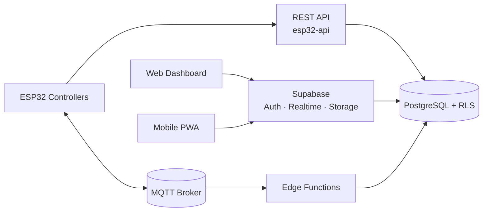
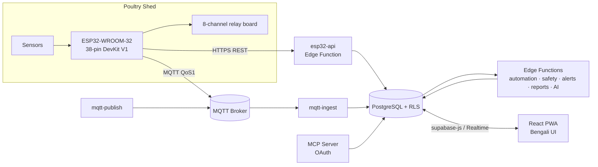

<div align="center">


# FarmEye

**Industrial IoT automation for commercial poultry farms — sensor telemetry, safety-first relay control and Bengali-language operations, from shed to cloud.**

[](https://react.dev)
[](https://www.typescriptlang.org)
[](https://vite.dev)
[](https://supabase.com)
[](https://www.postgresql.org)
[](https://www.espressif.com)
[](https://mqtt.org)
[](https://vite-pwa-org.netlify.app)

**Live application:** [farmeye.lovable.app](https://farmeye.lovable.app) · [farmeye.pro.bd](https://farmeye.pro.bd) · [modernfarm.pro.bd](https://modernfarm.pro.bd)

</div>

---

## Quick Links

| Resource | Link |
| --- | --- |
| Live application | https://farmeye.lovable.app |
| Documentation index | [Documentation Index](#documentation-index) |
| API documentation | [`public/openapi.yaml`](public/openapi.yaml) · in-app `/api-docs` |
| Installation guide | In-app `/installation-guide` · [`docs/firmware/SMART_LIGHTING.md`](docs/firmware/SMART_LIGHTING.md) |
| Lovable project | https://lovable.dev/projects/775899d0-e03c-4c5e-b9e0-fd88eee4e18a |

---

## Table of Contents

- [Project Overview](#project-overview)
- [Project Information](#project-information)
- [Key Features](#key-features)
- [System Architecture](#system-architecture)
- [Technology Stack](#technology-stack)
- [Project Structure](#project-structure)
- [Installation](#installation)
- [Development Setup](#development-setup)
- [Environment Variables](#environment-variables)
- [API Overview](#api-overview)
- [Database](#database)
- [Hardware](#hardware)
- [Firmware](#firmware)
- [Dashboard Features](#dashboard-features)
- [Screenshots](#screenshots)
- [Automation Features](#automation-features)
- [Security Features](#security-features)
- [Testing](#testing)
- [Documentation Index](#documentation-index)
- [Roadmap](#roadmap)
- [Contributing](#contributing)
- [License](#license)
- [Contact](#contact)

---

## Project Overview

FarmEye is a mobile-first, multi-tenant web application that monitors and controls environmental conditions inside poultry sheds using ESP32-based controllers. Sensor telemetry (temperature, humidity, ammonia, and additional air-quality metrics) is ingested through a REST edge API and an MQTT bridge, persisted in PostgreSQL, and rendered in a Bengali-language operator interface.

The platform is designed around a **hardware-as-source-of-truth** control model: the cloud writes only *desired* relay states, while the ESP32 firmware retains final authority over actual relay actuation and safety enforcement. This keeps the shed safe even when connectivity is lost.

> [!IMPORTANT]
> The user interface is Bengali-first. Product and vendor branding (Nexiot Labs) remains in English throughout the application.

**Intended users:** poultry farm owners, farm workers, organization administrators, and platform super-administrators.

---

## Project Information

| Field | Detail |
| --- | --- |
| Project type | Industrial IoT monitoring and control platform for poultry farms |
| Architecture | Multi-tenant (organization → farm → shed), hardware-as-source-of-truth control model |
| Frontend | React 18.3, TypeScript 5.8, Vite 5.4, Tailwind CSS 3.4, TanStack Query 5, React Router 6 |
| Backend | Lovable Cloud (Supabase): Deno edge functions, Auth, Realtime, Storage |
| Database | PostgreSQL with Row Level Security, 163 SQL migrations |
| Firmware | Arduino C/C++ for ESP32-WROOM-32, revisions v8 and v10 |
| Supported devices | ESP32-WROOM-32 38-pin DevKit V1 with 8-channel relay board; optional GSM SMS module |
| Supported platforms | Web browsers, installable PWA, Capacitor 8 Android and iOS shells |
| Languages | TypeScript, SQL, Arduino C/C++; Bengali-first UI with English product branding |

---

## Key Features

| Area | Capability |
| --- | --- |
| Live monitoring | Real-time temperature, humidity, gas/ammonia and water KPIs with status-coded cards |
| Device control | Manual and automatic relay control with pending/confirmed hardware state feedback |
| Safety engine | On-device safety invariants mirrored by a cloud-side `safety-engine` audit function |
| Automation | Server-side `automation-engine` writing `desired_*` state only |
| Multi-tenancy | Organization → farm → shed hierarchy with row-level security |
| Role model | `super_admin`, `org_owner`, `farm_owner`, `worker` with SQL permission helpers |
| Offline resilience | Client-side mutation queue and device-command queue with automatic replay |
| Alerting | In-app alerts, push notifications, SMS relay (Twilio / GSM), escalation and digests |
| Reporting | Daily/weekly farm reports, finance reports, CSV/XLSX/PDF exports |
| Firmware delivery | In-app code generator, version verifier, download gating, signed OTA manifest |
| Agent access | OAuth-protected MCP server exposing read-only farm tools |
| Mobile packaging | Installable PWA plus Capacitor Android/iOS shells |

---

## System Architecture

### High-level view



### Component view



**Control-flow contract**

```text
Cloud  ──writes──▶ desired_fan_on / desired_heater_on / ... (+ expiry)
ESP32  ──reads───▶ desired state, applies local safety invariants
ESP32  ──writes──▶ actual relay state + safety_status
UI     ──reads───▶ actual state only (never assumes success)
```

---

## Technology Stack

### Frontend

| Component | Technology |
| --- | --- |
| Framework | React 18.3 + TypeScript 5.8 |
| Build tool | Vite 5.4 (`@vitejs/plugin-react-swc`) |
| Styling | Tailwind CSS 3.4, `tailwindcss-animate`, `@tailwindcss/typography` |
| UI primitives | Radix UI / shadcn-style components, `lucide-react`, `sonner`, `vaul`, `cmdk` |
| State & data | TanStack Query 5 (+ persisted sync storage), React Context |
| Forms & validation | React Hook Form, Zod 4, `@hookform/resolvers` |
| Charts | Recharts 2 |
| Motion | Framer Motion 12 |
| Routing | React Router DOM 6 |
| PWA | `vite-plugin-pwa` |
| Exports | `jspdf`, `jspdf-autotable`, `xlsx`, `docx`, `jszip`, `file-saver` |
| Monitoring | Sentry (`@sentry/react`) |
| Mobile shells | Capacitor 8 (Android, iOS) |

### Backend

| Component | Technology |
| --- | --- |
| Platform | Lovable Cloud (Supabase) |
| Database | PostgreSQL with Row Level Security |
| Auth | Supabase Auth (email/password, Google OAuth) |
| Serverless | Deno-based Supabase Edge Functions (38 functions) |
| Realtime | Supabase Realtime subscriptions |
| Client SDK | `@supabase/supabase-js` 2 |
| Agent interface | `@lovable.dev/mcp-js` (OAuth issuer auth) |

### Firmware

| Component | Technology |
| --- | --- |
| MCU | ESP32-WROOM-32, 38-pin DevKit V1 |
| Language | Arduino C/C++ (`.ino`) |
| Transport | HTTPS REST + MQTT (QoS 1), optional GSM SMS failover |

### Tooling

Vitest 3 + Testing Library + jsdom, Playwright, ESLint 9 / typescript-eslint, k6 (load testing scripts).

---

## Project Structure

```text
.
├── docs/
│   ├── firmware/SMART_LIGHTING.md      # Lighting curve firmware notes
│   └── load-testing/                   # k6 script + methodology
├── e2e/                                # Playwright specs
├── public/
│   ├── esp32-*.ino, esp32-safety-engine.h   # Firmware sources shipped to users
│   ├── openapi.yaml                    # Public API specification
│   ├── llms.txt, robots.txt, sitemap.xml
│   └── sw.js, pwa-*.png                # PWA assets
├── src/
│   ├── components/                     # Feature-scoped UI (admin, control, dashboard, device, …)
│   ├── context/                        # Auth, Farm, DashboardSnapshot providers
│   ├── hooks/                          # ~120 domain hooks (sensors, automation, safety, offline)
│   ├── integrations/supabase/          # Auto-generated client + database types
│   ├── lib/                            # Pure logic: safety, gating, queues, exports, MCP tools
│   ├── pages/                          # Route-level screens
│   └── test/                           # Vitest unit & integration suites
├── supabase/
│   ├── config.toml                     # Edge function JWT verification settings
│   ├── functions/                      # 38 Deno edge functions
│   └── migrations/                     # 163 SQL migrations
├── capacitor.config.ts
├── playwright.config.ts
├── vitest.config.ts
└── vite.config.ts
```

---

## Installation

**Prerequisites:** Node.js (install via [nvm](https://github.com/nvm-sh/nvm#installing-and-updating)) and npm.

```sh
git clone <this-repository-url>
cd <repository-name>
npm install
npm run dev
```

The development server is served by Vite. See `vite.config.ts` for the configured host and port.

---

## Development Setup

| Script | Purpose |
| --- | --- |
| `npm run dev` | Start the Vite development server |
| `npm run build` | Production build |
| `npm run build:dev` | Build using development mode configuration |
| `npm run preview` | Preview a production build locally |
| `npm run lint` | Run ESLint across the repository |
| `npm test` | Run the Vitest suite once |
| `npm run test:watch` | Run Vitest in watch mode |
| `npm run test:e2e` | Run Playwright end-to-end tests |
| `npm run test:e2e:install` | Install the Chromium browser used by Playwright |

**Mobile builds** are produced with Capacitor using the `dist` web directory and the app configuration in `capacitor.config.ts`.

---

## Environment Variables

The frontend reads the following variables (present in `.env`, inlined by Vite at build time):

| Variable | Description |
| --- | --- |
| `VITE_SUPABASE_URL` | Backend project URL |
| `VITE_SUPABASE_PUBLISHABLE_KEY` | Publishable (anon) API key used by the browser client |
| `VITE_SUPABASE_PROJECT_ID` | Project reference, used for the MCP OAuth issuer URL |

> [!NOTE]
> `src/integrations/supabase/client.ts`, `types.ts`, and `.env` are generated by the platform and must not be edited manually. Server-side secrets are injected into edge functions at runtime and are never exposed to the browser.

---

## API Overview

The public contract is defined in [`public/openapi.yaml`](public/openapi.yaml) (OpenAPI 3.1) and rendered in-app on the **API Docs** page.

**Base URL:** `https://<project-ref>.supabase.co/functions/v1`

| Endpoint | Method | Tag | Purpose |
| --- | --- | --- | --- |
| `/esp32-api/sensor-data` | POST | ESP32 | Submit a sensor reading |
| `/esp32-api/desired-state` | GET | ESP32 | Poll cloud-desired relay state |
| `/automation-engine` | POST | Automation | Run server-side automation evaluation |
| `/safety-engine` | POST | Automation | Evaluate the hardcoded safety invariants (audit mirror) |
| `/ai-forecast` | GET | AI | 24-hour environment forecast |
| `/ai-forecast-7day` | GET | AI | 7-day health, mortality, feed and water forecast |
| `/heat-risk` | POST | AI | Heat-stress risk prediction |
| `/water-trend` | POST | AI | Water consumption anomaly detection |
| `/anomaly-detector` | POST | AI | Scheduled sensor drift and outlier detection |
| `/report-export` | POST | Reports | Export a farm report (PDF / CSV / XLSX) |
| `/export-data` | POST | Reports | Bulk sensor export |
| `/ota-firmware` | GET | ESP32 | Signed firmware OTA manifest |
| `/mqtt-publish` | POST | ESP32 | Publish a command to an MQTT topic |
| `/gsm-sms-relay` | POST | ESP32 | Send SMS through the GSM module |

**Authentication schemes**

| Scheme | Used by | Header |
| --- | --- | --- |
| `deviceToken` | ESP32 controllers | `Authorization: Bearer <DEVICE_TOKEN>` (HMAC token issued via `provision-device`) |
| `userJwt` | Web / mobile clients | `Authorization: Bearer <SUPABASE_JWT>` |

Functions with `verify_jwt = false` in `supabase/config.toml` (device, cron and webhook endpoints) perform their own token validation.

**MQTT topics consumed by `mqtt-ingest`:**

```text
farm/<farm_id>/dev/<device_id>/sensor   { temperature, humidity, ammonia?, ts }
farm/<farm_id>/dev/<device_id>/status   { uptime_s, wifi_rssi, free_heap, online }
```

---

## Database

PostgreSQL managed through 163 SQL migrations under `supabase/migrations/`. Typed access is provided by the generated `Database` type in `src/integrations/supabase/types.ts`.

| Concern | Implementation |
| --- | --- |
| Tenancy | `farm_id` / `user_id` scoping on tenant tables; all writes filter by `farm_id` |
| Access control | Row Level Security policies plus explicit `GRANT`s per role |
| Roles | Separate `user_roles` table with a `SECURITY DEFINER` `has_role()` helper |
| Telemetry | `sensor_readings` (active table) |
| Devices | `device_tokens`, `device_health`, `device_commands`, `mqtt_message_log` |
| Scheduling | `pg_cron` jobs driving ingestion, reconciliation and override expiry |
| Lifecycle | Soft delete (`farms.deleted_at`) with restore and permanent-delete admin actions |

> [!WARNING]
> Schema changes are additive by policy. Existing tables and API contracts are not overwritten, because deployed firmware depends on them.

---

## Hardware

| Item | Specification |
| --- | --- |
| Controller | ESP32-WROOM-32, **38-pin DevKit V1** |
| Actuation | 8-channel relay board on fixed GPIO assignments |
| Controlled loads | Exhaust fan, circulation fan, heater, light, fogger, sprinkler, alarm |
| Connectivity | Wi-Fi (HTTPS + MQTT), optional GSM module for SMS failover |
| Revisions | Two supported wiring revisions: **v8** and **v10** (different GPIO maps) |

The in-app **Pin Map & Sensors** page (`/pin-map`) and **Device Setup Wizard** (`/device-setup`) present the GPIO mapping and sensor checklist for the selected revision. A PCB design brief is included as `FarmEye_v8_PCB_Design_Brief.md`.

> [!CAUTION]
> v8 and v10 use different wiring. Firmware and wiring revision must match. The application verifies the version tag and GPIO map of a downloaded firmware file and blocks mismatched downloads behind an explicit confirmation dialog.

---

## Firmware

Firmware sources are served from `public/` and downloaded through the in-app code generator.

| File | Role |
| --- | --- |
| `esp32-industrial.ino` | Industrial controller firmware, revision v8 |
| `esp32-industrial-v10.ino` | Industrial controller firmware, revision v10 |
| `esp32-safety-engine.h` | Shared safety invariant implementation |
| `esp32-unified.ino` | Unified reference build |
| `esp32-code.ino` | Baseline REST example |
| `esp32-mqtt.ino` | MQTT transport variant |
| `esp32-ota-signed.ino` | Signed OTA update client |
| `esp32-failsafe.ino` | Legacy fail-safe build — **disabled**, kept for reference only (no hardware authority) |
| `esp32-gsm-sms.ino` | GSM SMS failover module |
| `esp32-phase9-sensors.ino` | Additional air-quality sensors (CO₂, PM2.5, PM10) |

**Delivery safeguards** (`src/lib/firmwareVerifier.ts`, `src/lib/firmwareDownloadGate.ts`):

- Cache-busting fetch of the firmware template to avoid stale downloads.
- Version-tag and GPIO-map parsing with match/mismatch verification.
- Download gating that cannot fire without an explicit user acknowledgement.
- Inline remediation guide and a retry action when verification fails.

Firmware behaviour notes are documented in [`docs/firmware/SMART_LIGHTING.md`](docs/firmware/SMART_LIGHTING.md).

---

## Dashboard Features

| Screen | Route | Contents |
| --- | --- | --- |
| Dashboard | `/` | KPI grid (temperature, humidity, gas, water), sensor trends, device status grid, today's activity |
| Control | `/control` | Manual and automatic relay control with farm-selection guard and hardware confirmation |
| Automation | `/automation` | Automation rules, modes and engine status |
| Alerts | `/alerts` | Alert timeline, summaries and delivery history |
| Farm Management | `/farm` | Farms, sheds, batches, daily logs |
| Finance Report | `/finance-report` | Batch-scoped expense and income reporting |
| Audit Log | `/audit-log` | Device command log and forensic timeline |
| Settings | `/settings` | Device, lighting, notification and farm settings |
| Members | `/settings/members` | Worker and membership management |
| Admin | `/admin`, `/org-admin`, `/platform-admin` | Role editor, organizations, farms, users |
| Worker | `/worker` | Simplified worker view with PIN lock |
| Setup | `/setup`, `/device-setup`, `/installation-guide`, `/pin-map` | Guided farm and device commissioning |
| Diagnostics | `/status`, `/security`, `/benchmark`, `/api-docs` | Status page, security report, benchmarks, API docs |

Additional UI behaviour implemented in the repository: dark/light theming, offline indicator and queued-mutation badge, push-notification support, voice command entry point, and haptic feedback on mobile.

---

## Screenshots

> [!NOTE]
> Screenshot files are not yet committed to the repository. The placeholders below reference `docs/screenshots/` and will render once the images are added.

| Screen | Preview |
| --- | --- |
| Login (`/login`) |  |
| Dashboard (`/`) |  |
| Control Panel (`/control`) |  |
| Automation (`/automation`) |  |
| Reports (`/finance-report`) |  |
| Mobile view (PWA) |  |

---

## Automation Features

- **Server-side automation engine** evaluating heat-stress index, bird-age curves, weather and ammonia trend, writing only `desired_*` columns.
- **Safety invariants** enforced on-device and mirrored in the cloud `safety-engine` for auditing; covered by `src/test/safety-invariants.test.ts`.
- **Mode gating** for Auto/Manual combined with the safety-engine toggle, implemented in `src/lib/controlModeGating.ts` and covered by regression tests.
- **Bounded manual overrides** with expiry timestamps reconciled by scheduled jobs.
- **Lighting curve** scheduling with gradual fade-in/fade-out and PWM output.
- **Broiler and layer modes** with age-based ventilation, heating and water monitoring hooks.
- **Weather-aware behaviour** via the `fetch-weather` function.
- **Offline command queue** with latest-wins deduplication, TTL expiry, tenant isolation and automatic drain when the device reconnects.
- **AI-assisted insights** (forecasting, heat risk, water trend, anomaly detection) delivered as edge functions.

---

## Safety Engine & Fail-Safe Mode

Livestock safety is the highest-priority subsystem in FarmEye and is **never** delegated to the cloud. The on-device arbiter (`public/esp32-safety-engine.h`, Invariant-Based Safety Arbiter v3.0) runs every **500 ms**, writes GPIO pins directly — bypassing the relay manager — and cannot be suppressed by any mode, override, schedule or OTA operation.

### The eight invariants

| ID | Invariant | Enforcement |
| --- | --- | --- |
| INV-1 | Temperature above the lethal high limit (38 °C) forces all ventilation on | Arbiter drives fan pins directly, continuously |
| INV-2 | Temperature below the lethal low limit (15 °C) allows heating regardless of mode | Heater permitted even in Manual/OFF |
| INV-3 | Actuator protection timers may never block a safety reaction | Minimum on/off timers are bypassed by the arbiter |
| INV-4 | Manual override can never disable safety evaluation | Override affects desired state only |
| INV-5 | OTA updates can never pause the safety loop | Arbiter tick continues during flashing |
| INV-6 | Two logical devices may never share one physical pin | GPIO map validated at boot |
| INV-7 | A missing or unreliable sensor triggers the worst-case survival environment | Sensor stale > 20 s → survival mode |
| INV-8 | Notification escalation is independent of connectivity | GSM/SMS path works with cloud offline |

### Fail-safe behaviour

| Condition | Fail-safe response |
| --- | --- |
| Cloud unreachable > 60 s | Autonomous local control; commands are queued client-side and drained on reconnect |
| Sensor missing/implausible > 20 s | Emergency Survival Mode — worst-case assumptions, ventilation biased on, heater restricted |
| Controller reboot / power recovery | Heater lockout 3 min, ventilation purge 3 min, ammonia alarm mute 5 min |
| Firmware hang | Hardware watchdog (10 s timeout) resets the controller into the safe boot sequence |
| Heater runs continuously > 5 min | Forced 2 min cooldown to prevent overheating and fire risk |
| Actuator has no measurable effect within 6 min | Effect-validation flags a suspected relay/actuator fault and raises an alert |
| Manual override left active | Bounded override expires automatically (20 min) and reconciles to automation |

### Cloud role (audit mirror only)

The `safety-engine` edge function re-evaluates the same invariants server-side purely for **auditing, alerting and reporting**. It writes `desired_*` columns and `safety_status`; it never overrides the controller's actual relay decision. The UI always renders `safety_status` reported by the hardware, so the dashboard reflects physical reality rather than intent.

Regression coverage: `src/test/safety-invariants.test.ts` (invariant matrix) and `src/lib/controlModeGating.ts` tests (Auto/Manual × safety-engine-enabled/disabled gating).

---


## Security Features

| Control | Implementation |
| --- | --- |
| Row Level Security | Enabled on tenant tables with explicit per-role policies and grants |
| Role separation | Dedicated `user_roles` table (never on profiles) with `SECURITY DEFINER` `has_role()` |
| Function hardening | Pinned `search_path`, restricted `EXECUTE` grants on database functions |
| Device authentication | HMAC device tokens issued by `provision-device`, rotatable via `rotate-device-secret` |
| Agent authentication | OAuth-protected MCP server with an in-app consent screen |
| Multi-tenant isolation | Verified by `src/test/tenant-isolation.test.ts` and org permission suites |
| Storage | Bucket listing restricted |
| Client-side guards | Route-level `ProtectedRoute` / `RoleProtectedRoute` / `RequirePermission` components |
| Observability | Sentry error reporting and an in-app security report page |

---

## Testing

| Suite | Location | Tooling |
| --- | --- | --- |
| Unit & integration | `src/test/` | Vitest, Testing Library, jsdom |
| Edge function integration | `supabase/functions/esp32-api/*_test.ts` | Deno test |
| End-to-end | `e2e/` | Playwright |
| Load testing | `docs/load-testing/` | k6 |

Existing suites cover safety invariants, control-mode gating, firmware verification and download gating, offline sync, canonical role mapping, organization permissions, and tenant isolation.

---

## Documentation Index

**Software**

| Document | Location |
| --- | --- |
| Machine-readable app summary | [`public/llms.txt`](public/llms.txt) |
| In-app documentation pages | `/installation-guide`, `/pin-map`, `/training` |

**Hardware**

| Document | Location |
| --- | --- |
| PCB design brief (v8) | [`FarmEye_v8_PCB_Design_Brief.md`](FarmEye_v8_PCB_Design_Brief.md) |

**Firmware**

| Document | Location |
| --- | --- |
| Smart lighting firmware notes | [`docs/firmware/SMART_LIGHTING.md`](docs/firmware/SMART_LIGHTING.md) |

**API**

| Document | Location |
| --- | --- |
| Public API specification (OpenAPI 3.1) | [`public/openapi.yaml`](public/openapi.yaml) |
| In-app API reference | `/api-docs` |

**Testing**

| Document | Location |
| --- | --- |
| End-to-end test notes | [`e2e/README.md`](e2e/README.md) |
| Load-testing methodology | [`docs/load-testing/README.md`](docs/load-testing/README.md) |

**Deployment**

| Document | Location |
| --- | --- |
| Edge function JWT verification settings | [`supabase/config.toml`](supabase/config.toml) |
| Mobile shell configuration | [`capacitor.config.ts`](capacitor.config.ts) |

---

## Roadmap

Items below are **Planned** and are not implemented in this repository:

- [ ] Planned — expand automated end-to-end coverage beyond the current Playwright spec.
- [ ] Planned — broader v10 field rollout once pilot deployments are validated.
- [ ] Planned — publish firmware release artefacts alongside the OTA manifest.

---

## Contributing

1. Fork the repository and create a feature branch.
2. Install dependencies with `npm install`.
3. Run `npm run lint` and `npm test` before opening a pull request.
4. Keep database changes additive — deployed firmware depends on existing tables and API contracts.
5. When reporting a hardware or firmware issue, state the controller revision (**v8** or **v10**); the GPIO maps and firmware files differ.

Changes made through the Lovable editor are committed to this repository, and pushes to `main` sync back into the editor.

---

## License

This repository currently contains **no open-source license file** (`LICENSE` / `LICENSE.md` is absent). Consequently, no license is granted: all rights are reserved by the copyright holder, Nexiot Labs.

Without an explicit license, third parties may not use, copy, modify, distribute or create derivative works from this source code. Licensing terms may be added later by including a license file in the repository root.

---

## Contact

**Nexiot Labs**

| Channel | Address |
| --- | --- |
| Company | Nexiot Labs |
| Official website | https://farmeye.pro.bd |
| Official website | https://modernfarm.pro.bd |
| Live application | https://farmeye.lovable.app |
| Lovable project | https://lovable.dev/projects/775899d0-e03c-4c5e-b9e0-fd88eee4e18a |

© 2026 Nexiot Labs.
